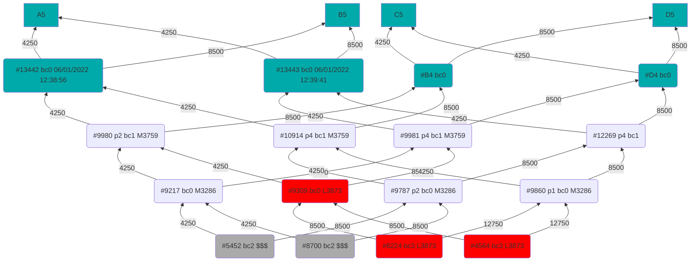

# Family Tree



# Breeding Cost
1. 4250 TUS + 52.5 CRA
1. 8500 TUS + 52.5 CRA
1. 12750 TUS + 52.5 CRA
1. 38250 TUS + 52.5 CRA
1. 76500 TUS + 52.5 CRA

# Deployed Players and Their Teams

## V1
- 0x019e96438ed58C7F18D799b7CC2006273F81318a
  - 3873: 9309,8224,4564
- 0xEFC8536AA8FdE6A7B15910a74b4B679cD94B337f

## V2
- 0x39A9551C9683d9955ADA8f91438eB18CEd8DbFcd

### Migration Script

```bash
npx hardhat playerdeploy --network mainnet
Player created: 0x39A9551C9683d9955ADA8f91438eB18CEd8DbFcd

npx hardhat playeraddowner --network mainnet --player 0x39A9551C9683d9955ADA8f91438eB18CEd8DbFcd --newowner 0xE90A22064F415896F1F72e041874Da419390CC6D
npx hardhat playeraddowner --network mainnet --player 0x39A9551C9683d9955ADA8f91438eB18CEd8DbFcd --newowner 0xc7C966754DBE52a29DFD1CCcCBfD2ffBe06B23b2

# Using attacker account as signer
npx hardhat playermigrateteam --network mainnet --playerfrom 0x019e96438ed58C7F18D799b7CC2006273F81318a --playerto 0x39A9551C9683d9955ADA8f91438eB18CEd8DbFcd --accountindex 1 --wait 3

npx hardhat playerlistteams --network mainnet  --player 0x39A9551C9683d9955ADA8f91438eB18CEd8DbFcd
4400: 9309,8224,4564

// change the attacker contract and team!!!
npx hardhat minestep --network mainnet --minerteamid 3759 --attackercontract 0x39A9551C9683d9955ADA8f91438eB18CEd8DbFcd --attackerteamid 4400 --wait 7
npx hardhat minestep --network mainnet --minerteamid 3286 --attackercontract 0x39A9551C9683d9955ADA8f91438eB18CEd8DbFcd --attackerteamid 4400 --wait 7

npx hardhat playerwithdrawerc20 --network mainnet --player 0x019e96438ed58C7F18D799b7CC2006273F81318a --accountindex 1
```


# Tasks Usage Example
## Localhost
```bash
npx hardhat setupplayertest --network localhost
[ 7929, 7939, 7224 ]

npx hardhat playerdeploy --network localhost --testaccount 0xB2f4C513164cD12a1e121Dc4141920B805d024B8
Player created: 0x71C9F079C03bEe608fF19c26B943E599DF115093
npx hardhat playersetapproval --network localhost --player 0x71C9F079C03bEe608fF19c26B943E599DF115093 --testaccount 0xB2f4C513164cD12a1e121Dc4141920B805d024B8

npx hardhat playerdeposit --network localhost --player 0x71C9F079C03bEe608fF19c26B943E599DF115093 --c1 7929 --c2 7939 --c3 7224 --testaccount 0xB2f4C513164cD12a1e121Dc4141920B805d024B8
npx hardhat playercreateteam --network localhost --player 0x71C9F079C03bEe608fF19c26B943E599DF115093 --c1 7929 --c2 7939 --c3 7224 --testaccount 0xB2f4C513164cD12a1e121Dc4141920B805d024B8
Team created: 3785
npx hardhat playerlistteams --network localhost --player 0x71C9F079C03bEe608fF19c26B943E599DF115093
3785: 7929,7939,7224
npx hardhat minestep --network localhost --minerteamid 3286 --attackercontract 0x71C9F079C03bEe608fF19c26B943E599DF115093 --attackerteamid 3785 --wait 1 --testaccount 0xB2f4C513164cD12a1e121Dc4141920B805d024B8
npx hardhat playerwithdrawerc20 --network localhost --player 0x71C9F079C03bEe608fF19c26B943E599DF115093 --testaccount 0xB2f4C513164cD12a1e121Dc4141920B805d024B8

npx hardhat playerclosegame --network localhost --player 0x71C9F079C03bEe608fF19c26B943E599DF115093 --teamid 3785 --testaccount 0xB2f4C513164cD12a1e121Dc4141920B805d024B8
npx hardhat playerremovefromteam --network localhost --player 0x71C9F079C03bEe608fF19c26B943E599DF115093 --teamid 3785 --position 1 --testaccount 0xB2f4C513164cD12a1e121Dc4141920B805d024B8
npx hardhat playerwithdraw --network localhost --player 0x71C9F079C03bEe608fF19c26B943E599DF115093 --crabadas 7939,7224 --testaccount 0xB2f4C513164cD12a1e121Dc4141920B805d024B8

# minestep with 5 attackers
npx hardhat minestep --network localhost --minerteamid 3286 --attackercontract 0x39A9551C9683d9955ADA8f91438eB18CEd8DbFcd --attackerteamid 4400 --wait 1 --testmineraccount 0xB2f4C513164cD12a1e121Dc4141920B805d024B8 --testattackeraccounts 0xc7C966754DBE52a29DFD1CCcCBfD2ffBe06B23b2,0xE90A22064F415896F1F72e041874Da419390CC6D,0x9568bD1eeAeCCF23f0a147478cEF87434aF0B5d4,0xbfca579D0eB8e294DeAe8C8a94cD3eF3c4836634
```

## Mainnet

### lootpending Setup

```bash
# Creating player using operation account
npx hardhat playerdeploy --network mainnet
Player created: 0xb972ADCAc416Fe6e6a3330c5c374b97046013796
Player created: 0x24A73065af5991278e71fe0058cd602c502ba41e
Player created: 0x5f99D122e14A6e8de1C191f9B6F6D1c4639ad21D
Player created: 0x01b6E5fD1C95bfB61b50013f3D3454B3CAf8742B
Player created: 0x891cd0c31130C2aF8e37C9bb32CB79770851d537

# Added router as owner of player, because router calls player.attack
npx hardhat playeraddowner --network mainnet --player 0xb972ADCAc416Fe6e6a3330c5c374b97046013796 --newowner 0x524Ba539123784d404aD3756815B3d46eF2A6430
npx hardhat playeraddowner --network mainnet --player 0x24A73065af5991278e71fe0058cd602c502ba41e --newowner 0x524Ba539123784d404aD3756815B3d46eF2A6430
npx hardhat playeraddowner --network mainnet --player 0x5f99D122e14A6e8de1C191f9B6F6D1c4639ad21D --newowner 0x524Ba539123784d404aD3756815B3d46eF2A6430
npx hardhat playeraddowner --network mainnet --player 0x01b6E5fD1C95bfB61b50013f3D3454B3CAf8742B --newowner 0x524Ba539123784d404aD3756815B3d46eF2A6430
npx hardhat playeraddowner --network mainnet --player 0x891cd0c31130C2aF8e37C9bb32CB79770851d537 --newowner 0x524Ba539123784d404aD3756815B3d46eF2A6430

# Added reinforce as owner of player, because reinforce calls player.reinforce
npx hardhat playeraddowner --network mainnet --player 0xb972ADCAc416Fe6e6a3330c5c374b97046013796 --newowner 0xBb6d9e4ac8f568E51948BA7d3aEB5a2C417EeB9f
npx hardhat playeraddowner --network mainnet --player 0x24A73065af5991278e71fe0058cd602c502ba41e --newowner 0xBb6d9e4ac8f568E51948BA7d3aEB5a2C417EeB9f
npx hardhat playeraddowner --network mainnet --player 0x5f99D122e14A6e8de1C191f9B6F6D1c4639ad21D --newowner 0xBb6d9e4ac8f568E51948BA7d3aEB5a2C417EeB9f
npx hardhat playeraddowner --network mainnet --player 0x01b6E5fD1C95bfB61b50013f3D3454B3CAf8742B --newowner 0xBb6d9e4ac8f568E51948BA7d3aEB5a2C417EeB9f
npx hardhat playeraddowner --network mainnet --player 0x891cd0c31130C2aF8e37C9bb32CB79770851d537 --newowner 0xBb6d9e4ac8f568E51948BA7d3aEB5a2C417EeB9f

# Added the looters external accounts as owners of router, because they will be calling router.attackTeams
npx hardhat routeraddowner --network mainnet --router 0x524Ba539123784d404aD3756815B3d46eF2A6430  --newowner 0xbfca579D0eB8e294DeAe8C8a94cD3eF3c4836634
npx hardhat routeraddowner --network mainnet --router 0x524Ba539123784d404aD3756815B3d46eF2A6430  --newowner 0x83Ff016a2e574b2c35d17Fe4302188b192b64344
npx hardhat routeraddowner --network mainnet --router 0x524Ba539123784d404aD3756815B3d46eF2A6430  --newowner 0x6315F93dEF48c21FFadD5CbE078Cdb19BAA661F8
npx hardhat routeraddowner --network mainnet --router 0x524Ba539123784d404aD3756815B3d46eF2A6430  --newowner 0xfa310944F9708DE3fd12A999Dfefe9B300C738cF
npx hardhat routeraddowner --network mainnet --router 0x524Ba539123784d404aD3756815B3d46eF2A6430  --newowner 0xC72F8A49dfb612302c1F4628f12D2795482D6077

# Signer (who owns crabadas) sets approval to manage all Crabada NFTs to Player contract.
npx hardhat playersetapproval --network mainnet --player 0xb972ADCAc416Fe6e6a3330c5c374b97046013796
npx hardhat playersetapproval --network mainnet --player 0x24A73065af5991278e71fe0058cd602c502ba41e
npx hardhat playersetapproval --network mainnet --player 0x5f99D122e14A6e8de1C191f9B6F6D1c4639ad21D
npx hardhat playersetapproval --network mainnet --player 0x01b6E5fD1C95bfB61b50013f3D3454B3CAf8742B
npx hardhat playersetapproval --network mainnet --player 0x891cd0c31130C2aF8e37C9bb32CB79770851d537

# First checks the teams status of Player contract.
npx hardhat playerlistteams --network mainnet --player 0xb972ADCAc416Fe6e6a3330c5c374b97046013796
npx hardhat playerlistteams --network mainnet --player 0x24A73065af5991278e71fe0058cd602c502ba41e
npx hardhat playerlistteams --network mainnet --player 0x5f99D122e14A6e8de1C191f9B6F6D1c4639ad21D
npx hardhat playerlistteams --network mainnet --player 0x01b6E5fD1C95bfB61b50013f3D3454B3CAf8742B
# 4400: 0,0,0

# Are moved the crabadas from signer's inventory to IddleGame in favor of Player contract.
npx hardhat playerdeposit --network mainnet --player 0xb972ADCAc416Fe6e6a3330c5c374b97046013796 --crabadas 12269,12712,9981,18396,9980,12714
npx hardhat playerdeposit --network mainnet --player 0xb972ADCAc416Fe6e6a3330c5c374b97046013796 --crabadas 9860,12777,18410

npx hardhat playerdeposit --network mainnet --player 0x24A73065af5991278e71fe0058cd602c502ba41e --crabadas 9787,19147,18770,9217,20505,21516,13443,22851,13977
npx hardhat playerdeposit --network mainnet --player 0x5f99D122e14A6e8de1C191f9B6F6D1c4639ad21D --crabadas 13442,10914,15430,15428,9309,4564,21517,20506,8224


# Are added the crabadas to the existing team
#npx hardhat playeraddtoteam --network mainnet --player 0xb972ADCAc416Fe6e6a3330c5c374b97046013796 --teamid 4400 --position 0 --crabada 12269
#npx hardhat playeraddtoteam --network mainnet --player 0xb972ADCAc416Fe6e6a3330c5c374b97046013796 --teamid 4400 --position 1 --crabada 12712
#npx hardhat playeraddtoteam --network mainnet --player 0xb972ADCAc416Fe6e6a3330c5c374b97046013796 --teamid 4400 --position 2 --crabada 9981

# Are created the new teams.
npx hardhat playercreateteam --network mainnet --player 0xb972ADCAc416Fe6e6a3330c5c374b97046013796 --c1 12269 --c2 12712 --c3 9981
npx hardhat playercreateteam --network mainnet --player 0xb972ADCAc416Fe6e6a3330c5c374b97046013796 --c1 18396 --c2 9980 --c3 12714
npx hardhat playercreateteam --network mainnet --player 0xb972ADCAc416Fe6e6a3330c5c374b97046013796 --c1 9860 --c2 12777 --c3 18410

npx hardhat playercreateteam --network mainnet --player 0x24A73065af5991278e71fe0058cd602c502ba41e --c1 9787 --c2 19147 --c3 18770
npx hardhat playercreateteam --network mainnet --player 0x24A73065af5991278e71fe0058cd602c502ba41e --c1 9217 --c2 20505 --c3 21516
npx hardhat playercreateteam --network mainnet --player 0x24A73065af5991278e71fe0058cd602c502ba41e --c1 13443 --c2 22851 --c3 13977

npx hardhat playercreateteam --network mainnet --player 0x5f99D122e14A6e8de1C191f9B6F6D1c4639ad21D --c1 13442 --c2 10914 --c3 15430
npx hardhat playercreateteam --network mainnet --player 0x5f99D122e14A6e8de1C191f9B6F6D1c4639ad21D --c1 15428 --c2 9309 --c3 4564
npx hardhat playercreateteam --network mainnet --player 0x5f99D122e14A6e8de1C191f9B6F6D1c4639ad21D --c1 21517 --c2 20506 --c3 8224


# First checks the teams final status of Player contract.
npx hardhat playerlistteams --network mainnet --player 0xb972ADCAc416Fe6e6a3330c5c374b97046013796

# Remove of crabadas from teams.
npx hardhat playerremovefromteam --network mainnet --player 0xb972ADCAc416Fe6e6a3330c5c374b97046013796 --teamid 4400 --position 0
npx hardhat playerremovefromteam --network mainnet --player 0xb972ADCAc416Fe6e6a3330c5c374b97046013796 --teamid 4400 --position 1
npx hardhat playerremovefromteam --network mainnet --player 0xb972ADCAc416Fe6e6a3330c5c374b97046013796 --teamid 4400 --position 2
npx hardhat playerremovefromteam --network mainnet --player 0xb972ADCAc416Fe6e6a3330c5c374b97046013796 --teamid 8700 --position 0
npx hardhat playerremovefromteam --network mainnet --player 0xb972ADCAc416Fe6e6a3330c5c374b97046013796 --teamid 8700 --position 1
npx hardhat playerremovefromteam --network mainnet --player 0xb972ADCAc416Fe6e6a3330c5c374b97046013796 --teamid 8700 --position 2
npx hardhat playerremovefromteam --network mainnet --player 0xb972ADCAc416Fe6e6a3330c5c374b97046013796 --teamid 8702 --position 0
npx hardhat playerremovefromteam --network mainnet --player 0xb972ADCAc416Fe6e6a3330c5c374b97046013796 --teamid 8702 --position 1
npx hardhat playerremovefromteam --network mainnet --player 0xb972ADCAc416Fe6e6a3330c5c374b97046013796 --teamid 8702 --position 2

npx hardhat playerwithdraw --network mainnet --player 0xb972ADCAc416Fe6e6a3330c5c374b97046013796 --crabadas 12269,12712,9981,18396,9980,12714,9860,12777,18410
```


### Create Player
```bash
npx hardhat playerdeploy --network mainnet
Player created: 0x019e96438ed58C7F18D799b7CC2006273F81318a
npx hardhat playersetapproval --network mainnet --player 0x019e96438ed58C7F18D799b7CC2006273F81318a
npx hardhat playerdeposit --network mainnet --player 0x019e96438ed58C7F18D799b7CC2006273F81318a --c1 9309 --c2 8224 --c3 4564
npx hardhat playercreateteam --network mainnet --player 0x019e96438ed58C7F18D799b7CC2006273F81318a --c1 9309 --c2 8224 --c3 4564
Team created: 
npx hardhat playerlistteams --network mainnet --player 0x019e96438ed58C7F18D799b7CC2006273F81318a
3873: 9309,8224,4564
npx hardhat minestep --network mainnet --minerteamid 3759 --attackercontract 0x019e96438ed58C7F18D799b7CC2006273F81318a --attackerteamid 3873 --wait 7
npx hardhat playerwithdrawerc20 --network mainnet --player 0x019e96438ed58C7F18D799b7CC2006273F81318a

npx hardhat playerclosegame --network mainnet --player 0x71C9F079C03bEe608fF19c26B943E599DF115093 --teamid 3785 --testaccount 0xB2f4C513164cD12a1e121Dc4141920B805d024B8
npx hardhat playerremovefromteam --network mainnet --player 0x71C9F079C03bEe608fF19c26B943E599DF115093 --teamid 3785 --position 1 --testaccount 0xB2f4C513164cD12a1e121Dc4141920B805d024B8
npx hardhat playerwithdraw --network mainnet --player 0x71C9F079C03bEe608fF19c26B943E599DF115093 --crabadas 7939,7224 --testaccount 0xB2f4C513164cD12a1e121Dc4141920B805d024B8

```

### Player: Change Crabada
```bash
# Remove of 4564
npx hardhat playerlistteams --network mainnet --player 0x39A9551C9683d9955ADA8f91438eB18CEd8DbFcd
npx hardhat settlegame --network mainnet --teamid 4400
npx hardhat playerremovefromteam --network mainnet --player 0x39A9551C9683d9955ADA8f91438eB18CEd8DbFcd --teamid 4400 --position 2 # In position 2: 4564
npx hardhat playersetapproval --network mainnet --player 0x39A9551C9683d9955ADA8f91438eB18CEd8DbFcd
npx hardhat playerdeposit --network mainnet --player 0x39A9551C9683d9955ADA8f91438eB18CEd8DbFcd --crabadas 12777
npx hardhat playeraddtoteam --network mainnet --player 0x39A9551C9683d9955ADA8f91438eB18CEd8DbFcd --teamid 4400 --position 2 --crabada 12777
npx hardhat playerlistteams --network mainnet --player 0x39A9551C9683d9955ADA8f91438eB18CEd8DbFcd

# optional withdraw
npx hardhat playerwithdraw --network mainnet --player 0x39A9551C9683d9955ADA8f91438eB18CEd8DbFcd --crabadas 12777
```


# Crabada Contracts Interfaces
```solidity

interface ICrabada{

    function approve(address to, uint256 tokenId) external;
    function safeTransferFrom(address from, address to, uint256 tokenId) external;
    function transferFrom(address from, address to, uint256 tokenId) external;
    function safeTransferFrom(address from, address to, uint256 tokenId, bytes calldata _data) external;
    function setApprovalForAll(address operator, bool approved) external;
    function breed(uint256 daddyId, uint256 mommyId) external;

    function getParentsInfo(uint256 tokenId) external view returns(uint256, uint256, uint256, uint256);
    function crabadaInfo(uint256) external view returns (uint256 daddyId, uint256 mommyId, uint256 dna, uint64 birthday, uint8 breedingCount);
    function ownerOf(uint256 tokenId) external view returns(address);
    function getApproved(uint256 tokenId) external view returns(address);
    function isApprovedForAll(address owner, address operator) external view returns(bool);

}

interface IIddleGame {

    function withdraw(address to, uint256[] calldata crabadaIds) external;
    function deposit(uint256[] calldata crabadaIds) external;
    function createTeam(uint256 crabadaId1, uint256 crabadaId2, uint256 crabadaId3) external returns(uint256 teamId);
    function addCrabadaToTeam(uint256 teamId, uint256 position, uint256 crabadaId) external;
    function removeCrabadaFromTeam(uint256 teamId, uint256 position) external;
    function attack(uint256 gameId, uint256 attackTeamId) external;

    function startGame(uint256 teamId) external;
    function closeGame(uint256 gameId) external;
    function settleGame(uint256 gameId) external;

    function getStats(uint256 crabadaId) external view returns(uint16 battlePoint, uint16 timePoint);
    function getTeamInfo(uint256 teamId) external view returns(address owner, uint256 crabadaId1, uint256 crabadaId2, uint256 crabadaId3, uint16 battlePoint, uint16 timePoint, uint256 currentGameId, uint128 lockTo);
    function ownerOf(uint256 crabadaId) external view returns(address);

    function setLendingPrice(uint256 crabadaId, uint256 price) external;

}

interface MarketPlace{

    event BuyCard(uint256 orderId, address buyer, address seller, uint256 cardId, uint256 cardPrice)
    
    function view currentOrderId() returns(uint256);
    
    function view sellOrders(uint256) returns(address owner, uint256 cardId, uint256 cardPrice);
}


```

