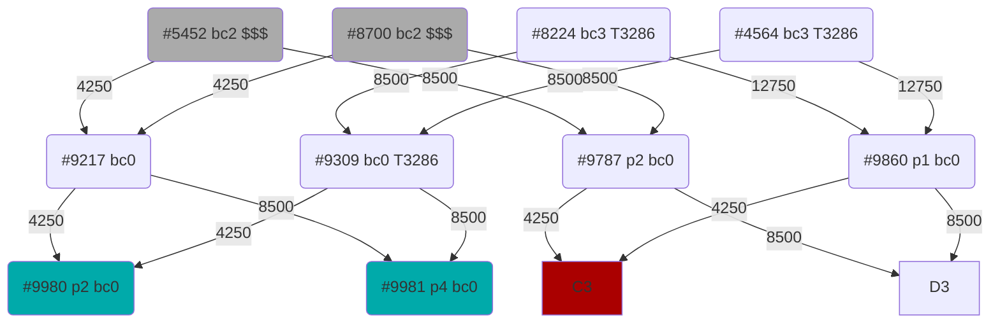

Prime: 54


4250
8500
12750
38250
76500





```javascript
28000+28000+28000+20000=104000 // Sell parents
53000-4500=48500 // Exchange 4500 TUS for 105*4 CRA 
104000-8500*2-17000*2=53000 // Breed childs
48500 -> 29.8153 // Convert remaining TUS to AVAX
```

```solidity

interface Crabada{
    event Breed(uint256 tokenId, uint256 daddyId, uint256 mommyId);

    function view crabadaInfo(uint256) returns (uint256 daddyId, uint256 mommyId, uint256 dna, uint64 birthday, breedingCount: uint8);

    function view ownerOf(tokenId: uint256) returns address;
}

interface MarketPlace{

    event BuyCard(uint256 orderId, address buyer, address seller, uint256 cardId, uint256 cardPrice)
    
    function view currentOrderId() returns(uint256);
    
    function view sellOrders(uint256) returns(address owner, uint256 cardId, uint256 cardPrice);
}


```